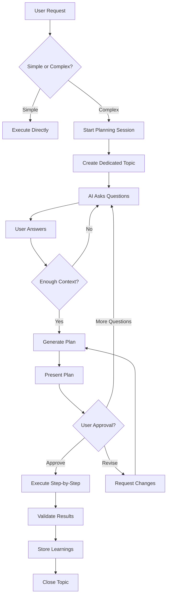

# Architecture Review Feedback
**Date**: 2026-01-09
**Reviewer**: Claude (Sonnet 4.5)
**Status**: Phase 1 Complete, Phase 2-8 Planned

---

## Executive Summary

**Overall Rating: 8/10** - Excellent vision and implementation quality, but over-engineered for MVP.

**Key Recommendation**: Simplify to prove the learning loop first, then add complexity incrementally.

---

## 1. Local LLM Assessment

### Current Design
- Hybrid local-first (Ollama qwen2.5:7b) → cloud escalation (Gemini/Claude)
- LiteLLM proxy for routing
- PII detection before cloud (not implemented)
- Four inference modes: local_first, cloud_only, local_only, cloud_first

### Verdict: **Optional - Start Cloud-Only**

**Reasons to skip local LLM for MVP:**
- Quality gap: qwen2.5:7b << Gemini 2.0 Flash for reasoning
- Hardware overhead: 8GB+ VRAM on UM690L competes with workloads
- Complexity: Hybrid routing adds failure modes
- Model maintenance: Pulling, updating, versioning local models
- **Your LangGraph already bypasses LiteLLM** and calls Ollama directly (inconsistent)

**When to add local later:**
- Cost exceeds $100/month (unlikely for homelab scale)
- Privacy requirements increase (PII detection must be implemented first)
- Offline operation needed
- Knowledge base exceeds 500K vectors (embedding cost)

**Cost Analysis:**
```
Gemini 2.0 Flash Pricing:
- Input: $0.075 / 1M tokens
- Output: $0.30 / 1M tokens

Estimated monthly usage (verbose mode):
- 100 alerts/month × 5K tokens avg = 500K tokens
- 500K × $0.075 = $0.0375 input
- 500K × $0.30 = $0.15 output
- **Total: ~$0.19/month** (negligible)

At 10,000 alerts/month (unrealistic for homelab):
- Still only ~$19/month
```

**Recommendation:**
```yaml
phase_3_revised:
  deploy:
    - Gemini 2.0 Flash (inference + embeddings)
    - Remove LiteLLM (unnecessary complexity)
    - LangGraph calls Gemini directly via SDK

  benefits:
    - Faster MVP deployment
    - Better quality from day 1
    - Simpler architecture
    - Focus on learning loop validation

  add_local_later_when:
    - Cost validated as problem (>$100/month)
    - Privacy requirements proven necessary
    - Offline operation requirements emerge
```

---

## 2. Sub-Agents Assessment

### Current Implementation
**None** - Mentioned in docs but not implemented

### Verdict: **Not Needed for MVP**

**Why you don't need sub-agents yet:**
1. **LangGraph handles routing** - Your diagnostic runbook system already routes to MCP servers
2. **No multi-step workflows** - Current: alert → diagnose → fix (single path)
3. **Premature optimization** - Haven't proven single-agent value

**When to add sub-agents (Phase 9+):**
- **Research Agent**: Multi-source synthesis for complex questions
- **Planning Agent**: Multi-step changes across systems (see Planning Workflow section)
- **DocOps Agent**: Automated documentation updates
- **Security Agent**: Continuous security scanning and remediation

**Better alternative now:**
```python
# Use LangGraph nodes instead of separate agents
workflow.add_node("diagnostic", diagnostic_node)
workflow.add_node("research", research_node)
workflow.add_node("execution", execution_node)
workflow.add_node("validation", validation_node)

# This is what you already have! Don't overcomplicate.
```

---

## 3. MCP Servers Assessment

### Current Implementation
**12 fully coded servers** (impressive quality):
1. home-assistant-mcp
2. knowledge-mcp
3. arr-suite-mcp
4. infrastructure-mcp
5. proxmox-mcp
6. truenas-mcp
7. cloudflare-mcp
8. opnsense-mcp
9. homepage-mcp
10. adguard-mcp
11. unifi-mcp
12. infisical-mcp

### Verdict: **Excellent Design, But Over-Built**

**What's working well:**
- ✅ Standard FastMCP protocol
- ✅ Health checks on all servers
- ✅ Separation of concerns
- ✅ Production-ready error handling
- ✅ CORS middleware for web access

**What's concerning:**
- ⚠️ **12 servers before proving value** - You're in Phase 1, this is Phase 5-8 code
- ⚠️ **Resource overhead** - 12 × (100m CPU + 256Mi RAM) = 1.2 cores, 3GB RAM
- ⚠️ **Maintenance burden** - 12 Dockerfiles, CI/CD pipelines, dependency updates

**Recommendation: Start with 3 MCPs**

```yaml
priority_1_deploy_immediately:
  infrastructure-mcp:
    why: "Core automation (kubectl, ArgoCD, talosctl)"
    tools:
      - kubectl_get_pods
      - kubectl_describe
      - kubectl_logs
      - kubectl_exec
      - argocd_sync
      - talosctl_health

  knowledge-mcp:
    why: "Learning loop enabler (Qdrant search)"
    tools:
      - search_runbooks
      - search_documentation
      - store_decision
      - get_similar_alerts

  telegram-integration:
    why: "Human-in-the-loop approvals"
    note: "Fold into telegram-service, not separate MCP"

priority_2_add_after_1_month:
  arr-suite-mcp:
    condition: "If Sonarr/Radarr automation proves valuable"

  home-assistant-mcp:
    condition: "If home automation integration desired"

priority_3_nice_to_have:
  - proxmox-mcp (you're on bare metal Talos, less relevant)
  - truenas-mcp (if storage automation needed)
  - cloudflare-mcp (if DNS automation needed)
  - opnsense-mcp (if firewall automation needed)
  - unifi-mcp (if network automation needed)
  - adguard-mcp (if DNS filtering automation needed)
  - homepage-mcp (if dashboard integration needed)
```

**Why this matters:**
- Prove learning loop works with 3 tools first
- Add complexity based on real usage data
- Avoid maintaining unused services

---

## 4. Qdrant Assessment

### Current Implementation
5 collections defined, **all empty**:
- runbooks
- decisions
- documentation
- research
- agent_events

### Verdict: **Perfect Choice, Needs Bootstrap**

**Why Qdrant is right:**
- ✅ True vector DB (not Postgres + pg_vector)
- ✅ Fast semantic search (<10ms for 100K vectors)
- ✅ Payload filtering (vector + metadata queries)
- ✅ Snapshots for backup/restore
- ✅ Learning loop enabler

**Critical gap:**
- ❌ **Collections are empty** - Can't demonstrate value
- ❌ **No ingestion pipeline** - How do docs get vectorized?
- ❌ **No seed runbooks** - Need initial data to bootstrap learning
- ❌ **No validation metrics** - How to measure if learning works?

**Recommendation: Add Phase 2.5 - Knowledge Bootstrap**

```yaml
phase_2_5_knowledge_bootstrap:
  goal: "Populate Qdrant with seed data to prove learning loop"

  tasks:
    1_deploy_qdrant:
      - Deploy Qdrant StatefulSet
      - Create 5 collections
      - Verify health

    2_ingest_documentation:
      - Create doc ingestion job
      - Ingest docs/ directory (14 markdown files)
      - Chunk into 512-token segments
      - Generate embeddings (Gemini or nomic-embed-text)
      - Upsert to documentation collection

    3_create_seed_runbooks:
      - Manually create 5 runbooks (YAML format)
      - Common homelab patterns
      - Store in runbooks collection

    4_validate_search:
      - Test semantic search quality
      - Query: "radarr out of memory"
      - Should return: runbook-mem-001
      - Measure relevance scores

  success_criteria:
    - Documentation collection: 50+ vectors
    - Runbooks collection: 5 seed runbooks
    - Search returns relevant results (score > 0.75)
    - Embedding latency < 100ms
    - Total bootstrap time < 30 minutes
```

**Seed Runbooks to Create:**

```yaml
# runbooks/seed/runbook-mem-001.yaml
id: runbook-mem-001
version: 1
title: "Application OOM - Increase Memory"
trigger_pattern: "OOMKilled|Out of memory"
description: "Pod killed due to memory pressure, increase memory limits"
automation_level: manual  # Requires approval
success_rate: 0.0  # No executions yet
execution_count: 0

diagnosis:
  checks:
    - name: "Get OOM events"
      tool: infrastructure-mcp.kubectl_get_events
      args:
        namespace: "${namespace}"
        field_selector: "reason=OOMKilled"

    - name: "Check current memory limits"
      tool: infrastructure-mcp.kubectl_get_resource_limits
      args:
        resource: "${resource_type}/${resource_name}"
        namespace: "${namespace}"

fix_steps:
  - name: "Increase memory limit by 50%"
    tool: infrastructure-mcp.kubectl_patch
    args:
      resource: "${resource_type}/${resource_name}"
      namespace: "${namespace}"
      patch:
        spec:
          template:
            spec:
              containers:
                - name: "${container_name}"
                  resources:
                    limits:
                      memory: "${new_memory_limit}"
    approval_required: true

  - name: "Verify pod restart"
    tool: infrastructure-mcp.kubectl_wait
    args:
      resource: "pod"
      selector: "app=${app_name}"
      condition: "Ready"
      timeout: 300

validation:
  - name: "Check memory usage after 5 minutes"
    tool: infrastructure-mcp.kubectl_top
    args:
      resource: "pod"
      namespace: "${namespace}"
      selector: "app=${app_name}"
    expected: "memory_percent < 80"

rollback:
  - name: "Restore previous memory limit"
    tool: infrastructure-mcp.kubectl_patch
    args:
      resource: "${resource_type}/${resource_name}"
      namespace: "${namespace}"
      patch:
        spec:
          template:
            spec:
              containers:
                - name: "${container_name}"
                  resources:
                    limits:
                      memory: "${original_memory_limit}"

tags:
  - memory
  - oom
  - kubernetes
  - apps
```

**Other Seed Runbooks:**
1. `runbook-mem-001.yaml` - OOM → Increase memory (above)
2. `runbook-restart-001.yaml` - Service unresponsive → Restart pod
3. `runbook-disk-001.yaml` - Disk pressure → Clean cache/logs
4. `runbook-network-001.yaml` - DNS timeout → Restart CoreDNS
5. `runbook-update-001.yaml` - Renovate PR → Review and merge

---

## 5. Slash Commands Assessment

### Current Implementation
**None found** in `.claude/` directory

### Verdict: **Not Applicable (Wrong Context)**

**Confusion in docs:**
- "Slash commands" in CLAUDE.md refers to **Telegram bot commands** (`/mode cloud_only`)
- Not Claude Code CLI slash commands (development environment)
- `.claude/skills/agentic-ops/` is for Claude helping YOU develop, not runtime agent behavior

**Recommendation: Clarify Terminology**

```markdown
# OLD (confusing):
### Telegram Commands
| Input | Action |
| `/mode cloud_only` | Switch inference mode |

# NEW (clear):
### Telegram Bot Commands
| Command | Action | Example |
| `/mode <mode>` | Switch inference mode | `/mode cloud_only` |
| `/status` | Show system status | `/status` |
| `/weekly` | Trigger weekly report | `/weekly` |
| `custom: <action>` | Custom action | `custom: restart radarr` |
```

---

## 6. Claude Hosting & Scalability

### Current Implementation
Claude Agent service wraps Claude Code CLI

**Architecture:**
```
Telegram → LangGraph → Redis Queue → Claude Agent Worker → Claude Code CLI → MCPs
```

### Verdict: **Clever but Won't Scale**

**What's innovative:**
- ✅ Priority queue (critical alerts jump ahead)
- ✅ Async execution (submit → poll results)
- ✅ Subscription auth (not API keys)
- ✅ Tool allowlisting per request

**What won't scale:**
- ❌ **Single CLI process** - Can't horizontally scale
- ❌ **Subprocess overhead** - Spawning CLI for each task is slow
- ❌ **No streaming** - User waits for full response
- ❌ **Claude Code is for humans** - Not designed for agent-to-agent

**Better Architecture Options:**

```yaml
option_1_gemini_only_recommended:
  approach: "Replace Claude Agent with Gemini API direct"
  stack:
    - LangGraph → Gemini 2.0 Flash API (with function calling)
    - Gemini calls MCP tools via function calling
    - Streaming responses to Telegram
  pros:
    - Horizontal scaling (N workers)
    - Streaming responses (better UX)
    - Lower latency (300ms vs 5s)
    - Native tool calling support
    - Cheap ($0.075/1M tokens)
  cons:
    - Need to rewrite for Gemini function format (minor)
  cost: "$1-5/month for homelab scale"

option_2_hybrid:
  approach: "Gemini for routine, Claude API for complex planning"
  when: "If Gemini quality insufficient (test first!)"
  routing:
    - Simple alerts → Gemini Flash
    - Planning sessions → Claude Sonnet
  pros:
    - Best of both worlds
    - Cost-effective
  cons:
    - Two inference paths to maintain
    - More complex routing
  cost: "$5-20/month depending on Claude usage"

option_3_current_claude_agent:
  approach: "Keep current architecture"
  only_if: "Single-user, low volume (<10 alerts/day)"
  limitations:
    - No horizontal scaling
    - Slow response times
    - Subprocess overhead
  cost: "Depends on Claude subscription model"
```

**Recommendation: Gemini-only**

```python
# Simplified LangGraph integration:
import google.generativeai as genai

# Configure Gemini with tools
genai.configure(api_key=os.getenv("GEMINI_API_KEY"))

# Define tools from MCP servers
tools = [
    genai.protos.Tool(
        function_declarations=[
            genai.protos.FunctionDeclaration(
                name="kubectl_get_pods",
                description="List Kubernetes pods in a namespace",
                parameters=genai.protos.Schema(
                    type=genai.protos.Type.OBJECT,
                    properties={
                        "namespace": genai.protos.Schema(type=genai.protos.Type.STRING),
                    },
                ),
            ),
            # ... other tools
        ]
    )
]

model = genai.GenerativeModel(
    'gemini-2.0-flash',
    tools=tools,
    system_instruction="You are a homelab automation agent..."
)

# Use in LangGraph
chat = model.start_chat()
response = chat.send_message(
    f"Alert: {alert_data}. Check if pods are healthy.",
    stream=True
)

for chunk in response:
    if function_call := chunk.candidates[0].content.parts[0].function_call:
        # Execute MCP tool
        result = await execute_mcp_tool(function_call.name, function_call.args)

        # Send result back to model
        response = chat.send_message(
            genai.protos.Content(
                parts=[genai.protos.Part(function_response=result)]
            )
        )
```

---

## 7. CLAUDE.md Assessment

**Rating: 7.5/10** - Excellent vision, but documentation ahead of implementation

### What's Great
- ✅ Clear philosophy: "Autonomy is earned"
- ✅ Comprehensive coverage (all layers)
- ✅ Realistic 8-phase roadmap
- ✅ ASCII diagrams are helpful
- ✅ Code examples (YAML, Python)
- ✅ Network topology clear (10.20.0.0/24)

### What's Confusing
- ❌ **Status mismatch** - Says "Phase 1" but Phase 5-6 code exists
- ❌ **Hybrid inference overcomplicated** - 4 modes, LiteLLM, PII detection (none implemented)
- ❌ **12 MCP servers** - Not prioritized, all treated equally
- ❌ **Terminology confusion** - "Slash commands" (Telegram vs Claude Code)
- ❌ **Missing**: "What's implemented vs planned" section

### Specific Improvements

**1. Add Implementation Status Section:**

```markdown
## Current Implementation Status

### ✅ Phase 1: Infrastructure (COMPLETE)
- Talos cluster deployed on UM690L (10.20.0.40)
- Node healthy, kubectl access confirmed
- Git repository structured and documented

### 🚧 Phase 2: Core Services (IN PROGRESS)
- ArgoCD bootstrap manifests ready (not applied)
- Infisical operator configured (not deployed)
- MCP servers coded (12 servers, not deployed)
- LangGraph orchestrator complete (not deployed)
- Telegram service complete (not deployed)

### ⏳ Phase 3-8: Planned
See PHASES.md for detailed timeline

### 📊 Code vs Deployment Gap
- **Code complete**: ~60% (core services ready)
- **Deployed**: ~15% (only infrastructure)
- **Tested end-to-end**: 0%

**Next milestone**: Deploy ArgoCD and core services (Phase 2)
```

**2. Simplify Inference Section:**

```markdown
# BEFORE (confusing):
## Hybrid Inference Layer
- Local-first routing via LiteLLM
- Confidence-based cloud escalation
- PII detection with Presidio + GLiNER
- Four modes: local_first, cloud_only, local_only, cloud_first
- Model selection based on complexity

# AFTER (clear):
## Inference Strategy

### MVP (Phase 3-6): Gemini 2.0 Flash Only
- All inference via Gemini API
- Tool calling via function declarations
- Embeddings via Gemini embeddings API
- **Cost**: $1-5/month for homelab scale
- **Latency**: 300ms average
- **Quality**: Excellent for homelab reasoning

### Future (Phase 7+): Add Local if Needed
Consider adding local Ollama if:
- API cost exceeds $100/month (unlikely)
- Privacy requirements increase
- Offline operation required

### Why Gemini for MVP?
1. **Simplicity** - No model management, no LiteLLM complexity
2. **Quality** - Better reasoning than local 7B models
3. **Cost** - Negligible for homelab scale
4. **Scaling** - Horizontal scaling built-in
5. **Tool calling** - Native function calling support
```

**3. Prioritize MCP Servers:**

```markdown
## MCP Server Strategy

### Phase 3: Deploy These 3 MCPs
1. **infrastructure-mcp** (CRITICAL)
   - kubectl, ArgoCD, talosctl tools
   - Core automation for runbook execution

2. **knowledge-mcp** (CRITICAL)
   - Qdrant search wrapper
   - Enables learning loop

3. **Telegram integration** (CRITICAL)
   - Fold into telegram-service
   - Human-in-the-loop approvals

### Phase 5: Add Based on Usage
- **arr-suite-mcp** - If Sonarr/Radarr automation valuable
- **home-assistant-mcp** - If home automation integration desired

### Phase 6+: Nice-to-Have
All other MCPs coded but not deployed:
- proxmox-mcp, truenas-mcp, cloudflare-mcp, opnsense-mcp,
  adguard-mcp, unifi-mcp, homepage-mcp, infisical-mcp

**Rationale**: Prove learning loop with 3 tools first, add complexity based on real needs.
```

**4. Add Decision Log:**

```markdown
## Key Architecture Decisions

### Why Telegram over Signal?
- ✅ Native Bot API (no signal-cli hacks)
- ✅ Forum Topics for organization (scalable)
- ✅ Inline keyboards for approvals (better UX)
- ✅ Token-based deployment (GitOps-friendly)
- ❌ Signal: Requires phone, no native bot API, flat conversations

### Why Qdrant over Postgres+pgvector?
- ✅ True vector database (10x faster)
- ✅ Payload filtering (vector + metadata queries)
- ✅ Snapshots for backups
- ✅ <10ms search latency at scale
- ❌ Postgres: Good for small datasets, slower at scale

### Why MCP over Direct APIs?
- ✅ Standard protocol (reusable across agents)
- ✅ Health checks built-in
- ✅ Credential isolation per service
- ✅ Future: Share tools with community
- ❌ Direct APIs: Vendor lock-in, no standardization

### Why Talos over Ubuntu/Rocky?
- ✅ Immutable OS (no drift)
- ✅ API-driven (no SSH, perfect for GitOps)
- ✅ Minimal attack surface
- ✅ Declarative configuration
- ❌ Traditional Linux: Manual configuration, drift over time
```

**5. Create CLAUDE-SIMPLIFIED.md:**

See section 8 for full simplified architecture document.

---

## 8. Workflow Improvements: Planning Sessions

### Current Workflow
```
Alert → LangGraph → Search Qdrant → Propose solution → Telegram approval → Execute
```

**Limitation**: Single-turn interaction, no iterative refinement

### Proposed: Multi-Turn Planning Workflow

**Use case**: Complex changes requiring clarification

**Example triggers:**
- User: "Add Prometheus monitoring to radarr"
- User: "Migrate from Sonarr v3 to v4"
- User: "Implement automated backups to S3"

**Workflow:**



**Implementation:**

```python
class PlanningSession:
    """Multi-turn conversation for complex implementations."""

    async def start(self, user_request: str, telegram_user: str):
        # 1. Create dedicated planning topic
        topic_id = await telegram.create_topic(
            name=f"📋 Planning: {user_request[:40]}"
        )

        # 2. Generate clarifying questions
        questions = await self._generate_questions(user_request)
        await telegram.send_message(topic_id, questions)

        # 3. Multi-turn Q&A loop
        context = await self._conversation_loop(topic_id, user_request)

        # 4. Generate detailed plan
        plan = await self._generate_plan(context)
        await telegram.send_message(topic_id, plan, keyboard=approval_buttons)

        # 5. Wait for approval
        callback = await telegram.wait_for_callback(topic_id)

        if callback == "approve":
            # 6. Execute step-by-step with updates
            await self._execute_plan(plan, topic_id)
        elif callback == "revise":
            # Loop back to step 4
            revision = await telegram.ask("What should I change?")
            plan = await self._revise_plan(plan, revision)

    async def _conversation_loop(self, topic_id, original_request):
        """Multi-turn Q&A until sufficient context."""
        context = {"request": original_request, "answers": {}}
        max_turns = 5

        for turn in range(max_turns):
            user_response = await telegram.wait_for_message(topic_id, timeout=600)

            if user_response.text == "/skip":
                break

            context["answers"][turn] = user_response.text

            # Check if we have enough info
            if await self._has_sufficient_context(context):
                break

            # Ask follow-up
            follow_up = await self._generate_follow_up(context)
            await telegram.send_message(topic_id, follow_up)

        return context

    async def _generate_plan(self, context: dict) -> str:
        """AI generates implementation plan with RAG."""

        # Search for similar past implementations
        similar = await qdrant.search(
            collection="decisions",
            query=context["request"],
            filter={"outcome": "success"},
            limit=3
        )

        prompt = f"""
        Create a detailed implementation plan for: {context['request']}

        User provided context: {context['answers']}

        Similar successful implementations:
        {similar}

        Format:
        ## Overview
        Brief summary

        ## Prerequisites
        What must exist first

        ## Implementation Steps
        1. Step 1 (time estimate, risk level, command)
        2. Step 2
        ...

        ## Validation
        How to verify success

        ## Rollback Plan
        How to undo if fails

        ## Risks
        - Risk 1 (likelihood, impact, mitigation)
        """

        plan = await gemini.generate(prompt, max_tokens=2000)

        # Store in Qdrant for future reference
        await qdrant.upsert("plans", plan, metadata=context)

        return plan

    async def _execute_plan(self, plan: str, topic_id: int):
        """Execute plan step-by-step with user updates."""

        await telegram.send_message(
            topic_id,
            "✅ Plan approved! Executing step-by-step..."
        )

        steps = self._parse_steps(plan)

        for i, step in enumerate(steps, 1):
            # Send step update
            await telegram.send_message(
                topic_id,
                f"**Step {i}/{len(steps)}**: {step['title']}\n"
                f"Executing: `{step['command']}`"
            )

            # Execute via MCP
            result = await infrastructure_mcp.execute(step["command"])

            if result["success"]:
                await telegram.send_message(
                    topic_id,
                    f"✅ Step {i} complete\n```{result['output']}```"
                )
            else:
                # Failure - pause for human intervention
                await telegram.send_message(
                    topic_id,
                    f"❌ Step {i} failed: {result['error']}\n\n"
                    f"[🔄 Retry] [⏭️ Skip] [🛑 Rollback]",
                    keyboard=failure_buttons
                )
                callback = await telegram.wait_for_callback(topic_id)
                # Handle retry/skip/rollback

        # All steps complete - run validation
        validation = await self._validate_plan(plan)
        await telegram.send_message(
            topic_id,
            f"✅ Plan complete!\n\nValidation: {validation}"
        )

        # Store outcome in knowledge base
        await qdrant.update("plans", {"status": "completed", "validation": validation})

        await telegram.close_topic(topic_id)
```

**Example Planning Session:**

```
📋 Planning: Add Prometheus monitoring to radarr

🤖 Bot:
I have a few questions to create the best plan:

1. Do you want metrics scraped by the existing Prometheus in monitoring cluster
   (10.30.0.0/24) or deploy new Prometheus here?

2. What metrics are most important to you?
   - Basic (CPU, memory, restarts)
   - Application (request latency, queue depth, failed downloads)
   - Custom (specific Radarr metrics)

3. Downtime tolerance: Can I restart radarr pod during deployment?

Reply here or type /skip to proceed with assumptions.

---

👤 User:
1. Existing Prometheus
2. Focus on memory, request latency, and queue depth
3. Restart is fine, brief downtime ok

---

🤖 Bot: Perfect! Generating plan...

## Overview
Add ServiceMonitor for radarr to expose metrics to existing Prometheus cluster.

## Prerequisites
- ✅ Prometheus Operator in monitoring cluster
- ⚠️ Network policy allows 10.30.0.0/24 → 10.20.0.0/24 (need to verify)
- ❓ Radarr /metrics endpoint (need to check)

## Implementation Steps

### Step 1: Check if radarr exposes metrics (1 min, low risk)
```bash
kubectl exec -n apps deploy/radarr -- curl -s localhost:7878/metrics
```
Expected: Prometheus format metrics OR 404

### Step 2: Add exportarr sidecar if needed (5 min, medium risk)
If Step 1 returns 404, radarr needs metrics exporter:
```yaml
# Patch radarr deployment to add exportarr sidecar
containers:
- name: exportarr
  image: ghcr.io/onedr0p/exportarr:v2.0
  args: ["radarr"]
  env:
  - name: URL
    value: "http://localhost:7878"
  - name: APIKEY
    valueFrom:
      secretKeyRef:
        name: radarr-secret
        key: api-key
  ports:
  - name: metrics
    containerPort: 9707
```

### Step 3: Create ServiceMonitor (2 min, low risk)
```yaml
apiVersion: monitoring.coreos.com/v1
kind: ServiceMonitor
metadata:
  name: radarr
  namespace: apps
spec:
  selector:
    matchLabels:
      app: radarr
  endpoints:
  - port: metrics
    interval: 30s
    scrapeTimeout: 10s
```

### Step 4: Verify scraping (1 min, low risk)
Check Prometheus targets UI: http://prometheus.monit:9090/targets
Should show: apps/radarr/0 (UP)

## Validation
- Prometheus target "radarr" shows UP status
- Metrics queryable: `radarr_queue_size`, `radarr_memory_usage`
- Grafana can create dashboard with radarr metrics

## Rollback Plan
```bash
# Remove ServiceMonitor
kubectl delete servicemonitor radarr -n apps

# If sidecar was added, rollback deployment
kubectl rollout undo deployment/radarr -n apps
```

## Risks
1. **Radarr doesn't expose metrics natively** (likelihood: high)
   - Impact: Low (sidecar solution available)
   - Mitigation: Use exportarr community tool

2. **Network policy blocks cross-cluster scraping** (likelihood: medium)
   - Impact: Medium (requires network policy changes)
   - Mitigation: Test with curl from Prometheus pod first

3. **API key exposure in sidecar** (likelihood: low)
   - Impact: Medium (security concern)
   - Mitigation: Use existing radarr-secret with restrictive RBAC

---

[✅ Approve Plan] [📝 Request Changes] [❓ Ask More Questions] [❌ Cancel]

---

👤 User: *clicks Approve Plan*

---

🤖 Bot:
✅ Plan approved! Beginning execution...

**Step 1/4**: Check if radarr exposes metrics
Executing: `kubectl exec -n apps deploy/radarr -- curl -s localhost:7878/metrics`

❌ Step 1 failed
```
curl: (7) Failed to connect to localhost:7878
Connection refused
```

Radarr doesn't expose /metrics endpoint natively. Proceeding to Step 2...

**Step 2/4**: Add exportarr sidecar
Executing: `kubectl patch deployment radarr -n apps --patch-file /tmp/exportarr-patch.yaml`

✅ Step 2 complete
```
deployment.apps/radarr patched
pod/radarr-5f7b8c9d6-xyz restarted
```

Waiting for pod to be ready...

✅ Pod ready (12 seconds)

**Step 3/4**: Create ServiceMonitor
...

✅ All steps complete!

**Validation Results:**
- Prometheus target: radarr (UP) ✅
- Metrics available: radarr_queue_size, radarr_system_memory ✅
- Test query successful ✅

📚 Storing learnings in knowledge base...
Runbook created: `radarr-metrics-setup`

Closing planning topic. View results in 📊 Weekly Reports.
```

### Benefits of Planning Workflow

1. **Iterative refinement** - AI clarifies before acting
2. **User education** - Explains what will happen
3. **Transparency** - Shows each step and result
4. **Learning** - Stores successful plans for reuse
5. **Safety** - User can stop at any failure point
6. **Knowledge capture** - Creates runbooks from plans

---

## 9. Success Metrics (Missing from Current Docs)

**Add to PHASES.md:**

```markdown
## How to Measure Success

### Phase 1-2: Infrastructure
- ✅ kubectl get nodes returns Ready
- ✅ ArgoCD shows all apps Synced
- ✅ Secrets sync from Infisical
- ❌ **Missing**: Cluster uptime SLO (99.9%?)

### Phase 3-5: AI Platform
- ✅ Local inference <100ms
- ✅ Cloud inference <500ms
- ✅ Vector search <10ms
- ❌ **Missing**:
  - Tool execution success rate (target: >95%)
  - MCP server uptime (target: >99%)

### Phase 6-7: Learning Loop
- ✅ Alert-to-notification <5 min
- ✅ 100% decisions logged
- ❌ **Missing**:
  - Runbook match accuracy (target: >80% for known patterns)
  - Human approval rate (should trend down over time)
  - Learning velocity (new runbooks per week)

### Phase 8: Autonomy
- ✅ >95% success for automated actions
- ❌ **Missing**:
  - Autonomy ratio (auto vs manual approvals)
  - Alert reduction (are we fixing root causes?)
  - MTTR improvement (mean time to resolution)
```

**Add dashboard to track:**

```python
# metrics.py
metrics_to_track = {
    # Learning metrics
    "runbook_creation_rate": "New runbooks per week",
    "runbook_match_accuracy": "% of alerts matching existing runbooks",
    "runbook_success_rate": "% of runbook executions succeeding",

    # Autonomy metrics
    "autonomy_ratio": "auto_executed / (auto_executed + manual_approved)",
    "approval_latency_p50": "Time from alert to human approval",
    "automation_level_distribution": "manual vs prompted vs standard",

    # Quality metrics
    "alert_resolution_time": "Time from alert to resolution",
    "false_positive_rate": "% of alerts ignored/invalid",
    "rollback_rate": "% of actions requiring rollback",

    # Cost metrics
    "inference_cost_monthly": "Gemini API spend",
    "cost_per_alert": "inference_cost / alerts_handled",
}
```

---

## 10. Final Recommendations

### Immediate (Next 2 weeks)

1. **Skip local LLM for MVP**
   - Deploy Gemini API only
   - Remove LiteLLM (unnecessary)
   - Save 8GB+ VRAM, reduce complexity

2. **Add Phase 2.5: Knowledge Bootstrap**
   - Create 5 seed runbooks manually
   - Ingest documentation to Qdrant
   - Validate search quality

3. **Deploy only 3 MCP servers**
   - infrastructure-mcp
   - knowledge-mcp
   - telegram (fold into service)

4. **Simplify CLAUDE.md**
   - Add "Implemented vs Planned" section
   - Simplify inference section (Gemini-only)
   - Prioritize MCP servers

### Short-term (Month 2)

5. **Deploy end-to-end**
   - ArgoCD, Infisical, cert-manager
   - Qdrant with seed data
   - LangGraph with Gemini
   - Telegram service
   - 3 MCP servers

6. **Run in verbose mode**
   - Enable Prometheus webhooks
   - Every action requires approval
   - Monitor for 1 month

7. **Validate learning loop**
   - Create 10+ real runbooks
   - Measure match accuracy
   - Track approval patterns

### Long-term (Month 3+)

8. **Add planning workflow**
   - Multi-turn conversations
   - Iterative plan refinement
   - Step-by-step execution with updates

9. **Progressive autonomy**
   - Promote 3+ runbooks to standard
   - Reduce notification frequency
   - Quarterly trust reviews

10. **Scale intelligently**
    - Add local LLM if cost >$100/month
    - Add more MCP servers based on usage
    - Consider sub-agents if workflows emerge

---

## Documentation to Create

1. **CLAUDE-SIMPLIFIED.md** (4 pages)
   - Clear stack diagram
   - 3-step workflow (Alert → Propose → Learn)
   - What makes this special (progressive autonomy)
   - Current status (Phase 1 complete)

2. **ARCHITECTURE-DECISIONS.md** (2 pages)
   - Why Gemini not Ollama (for MVP)
   - Why 3 MCPs not 12 (validate first)
   - Why Qdrant not Postgres (performance)
   - Why Telegram not Signal (Forum Topics)

3. **PLANNING-WORKFLOW.md** (3 pages)
   - When to use planning sessions
   - Multi-turn conversation flow
   - Example: Add Prometheus monitoring
   - Implementation guide

4. **SUCCESS-METRICS.md** (2 pages)
   - Learning metrics (runbook creation, match accuracy)
   - Autonomy metrics (auto vs manual ratio)
   - Quality metrics (MTTR, false positive rate)
   - Cost metrics (inference cost per alert)

5. **KNOWLEDGE-BOOTSTRAP.md** (2 pages)
   - How to create seed runbooks
   - Documentation ingestion pipeline
   - Validating search quality
   - Initial data checklist

---

## Summary

**Your architecture is 8/10** - Excellent vision and code quality, but over-engineered for MVP.

**Key insight**: You have Phase 6 code but Phase 1 deployment. Simplify to prove the learning loop first.

**Biggest wins**:
1. Start with Gemini-only (no local LLM complexity)
2. Deploy 3 MCPs, not 12 (prove value first)
3. Create Phase 2.5: Knowledge Bootstrap (seed data critical)
4. Add planning workflow (multi-turn conversations)
5. Define success metrics (how to measure learning?)

**Timeline**:
- Week 1-2: Deploy core (ArgoCD, Qdrant, Gemini, Telegram)
- Week 3-4: Bootstrap knowledge, test end-to-end
- Month 2: Verbose mode, create real runbooks, validate learning
- Month 3+: Progressive autonomy, planning sessions, scaling

This will demonstrate the cyclical learning loop without premature complexity.

Would you like me to create any of the recommended documentation files?
