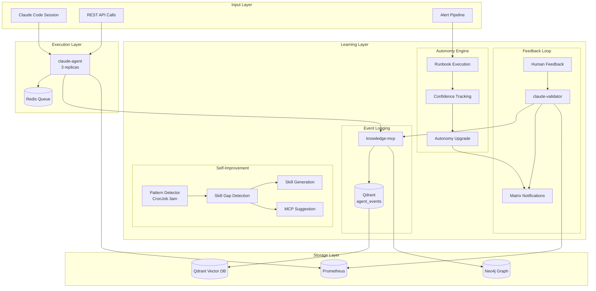
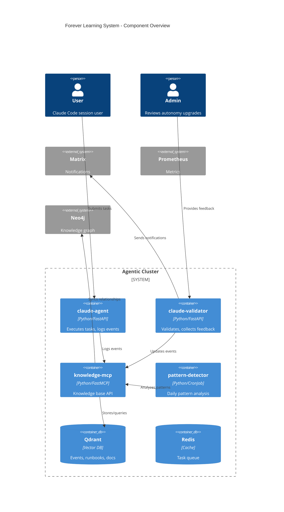
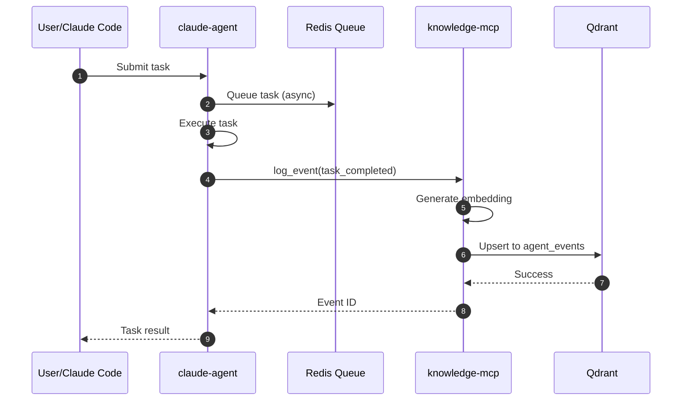
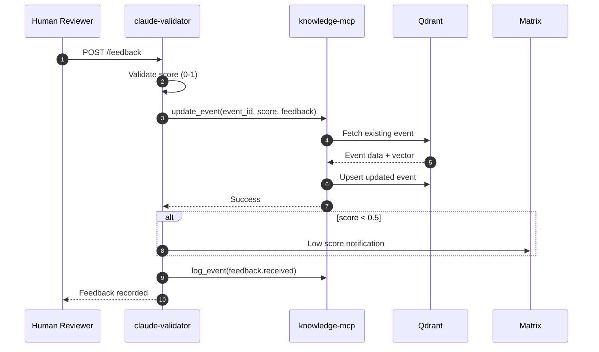
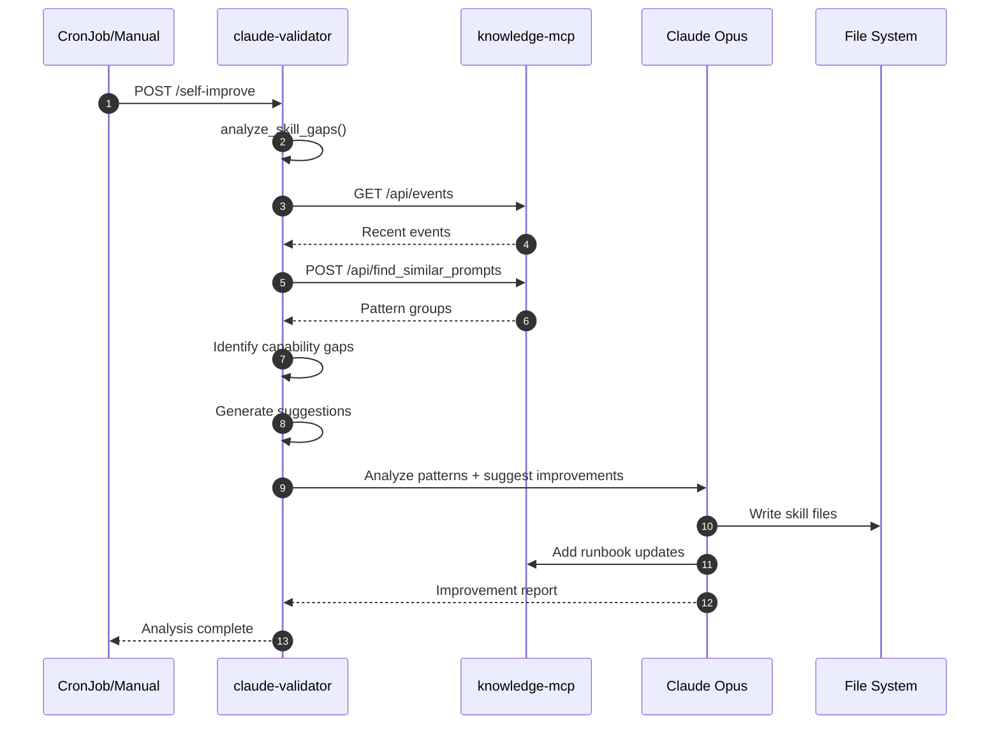
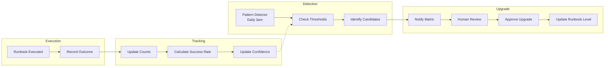
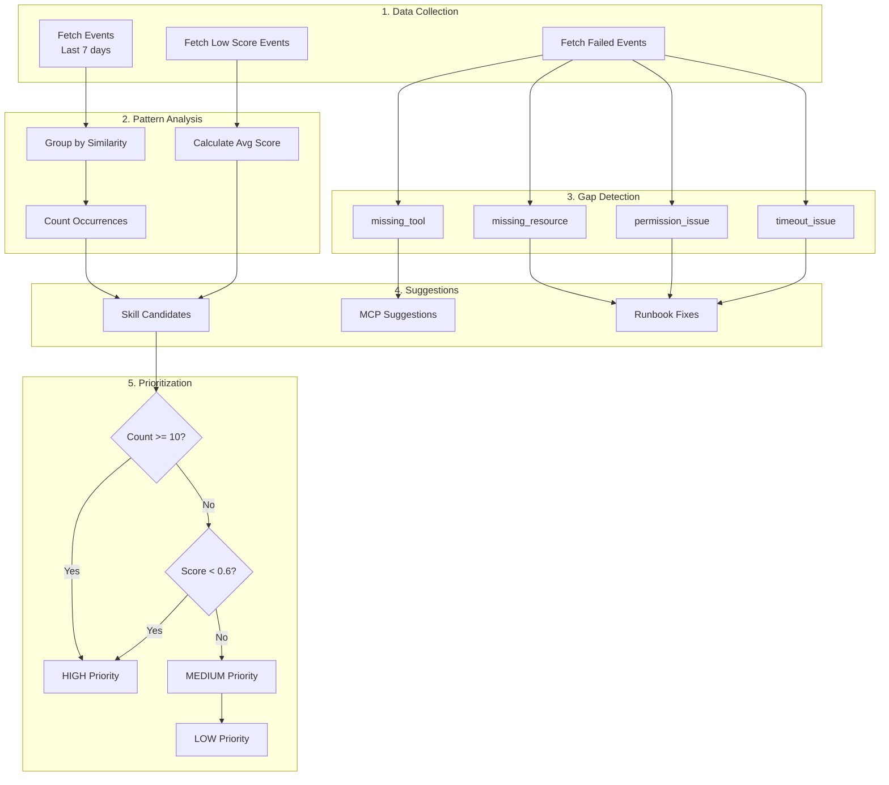
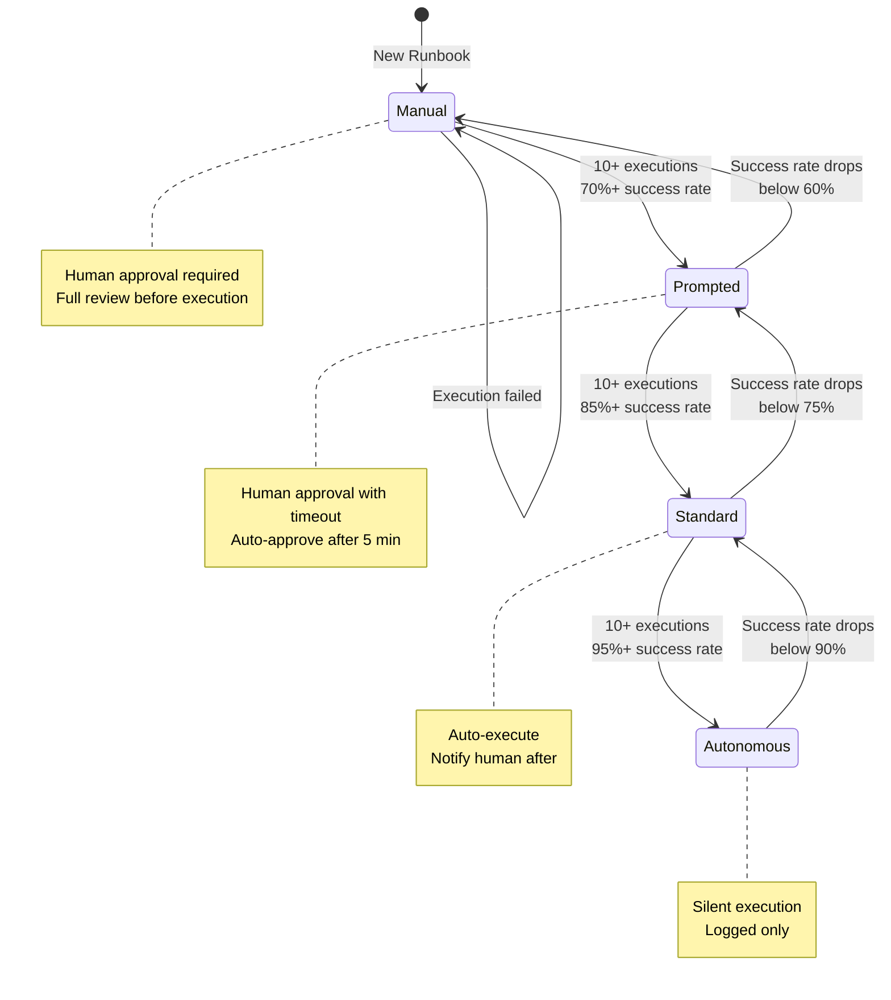

# Forever Learning System

## Executive Summary

The Forever Learning System transforms the Kernow homelab AI platform into a self-improving system that learns from every interaction, tracks outcomes, and progressively increases autonomy based on demonstrated reliability.

**Core Philosophy**: The AI doesn't just execute tasks—it remembers what worked, learns your preferences, and gets smarter over time. Autonomy is earned through demonstrated reliability, not configured upfront.

---

## Table of Contents

1. [Architecture Overview](#architecture-overview)
2. [System Components](#system-components)
3. [Data Flow](#data-flow)
4. [Phase Implementation Details](#phase-implementation-details)
5. [API Reference](#api-reference)
6. [Autonomy Progression](#autonomy-progression)
7. [Metrics and Observability](#metrics-and-observability)
8. [Integration Points](#integration-points)
9. [Troubleshooting](#troubleshooting)

---

## Architecture Overview



### System Component Diagram



### Key Principles

1. **Every Interaction is Logged**: All claude-agent tasks emit events to Qdrant's `agent_events` collection
2. **Feedback Closes the Loop**: Humans can rate outcomes, and the system learns from this feedback
3. **Autonomy is Earned**: Runbooks start at "manual" and graduate to higher autonomy through demonstrated success
4. **Patterns Become Skills**: Repeated queries are detected and can become automated skills
5. **Gaps Become MCPs**: Missing capabilities are identified and MCP servers can be auto-generated

---

## System Components

### 1. Event Logging Layer (Phase 1)

**Purpose**: Capture every interaction for learning and analysis

**Components**:
- `claude-agent`: Emits events after task completion
- `knowledge-mcp`: Provides `log_event()` MCP tool and REST API
- `agent_events` collection in Qdrant: Stores all events with embeddings

**Event Schema**:
```json
{
  "id": "uuid",
  "event_type": "agent.chat.complete | agent.error | task.complete | runbook.executed | feedback.received | validation.complete | pattern.analysis",
  "timestamp": "ISO-8601",
  "source_agent": "claude-agent | claude-validator | pattern-detector",
  "description": "Natural language description of what happened",
  "metadata": {
    "task_id": "string",
    "model": "opus | sonnet",
    "latency_ms": 1234,
    "prompt_length": 500,
    "response_length": 1000,
    "tools_used": ["Read", "Write"],
    "worker_id": "pod-name"
  },
  "resolution": "completed | failed | partial | escalated",
  "score": 0.0-1.0,
  "feedback": "Human feedback text"
}
```

### 2. Feedback Loop (Phase 2)

**Purpose**: Track if solutions actually worked and update learning metrics

**Components**:
- `claude-validator`: `/feedback` POST endpoint
- `knowledge-mcp`: `update_event()` MCP tool and REST API
- Prometheus metrics: `claude_validator_feedback_score`, `claude_validator_feedback_total`

**Feedback Schema**:
```json
{
  "event_id": "uuid of original event",
  "score": 0.0-1.0,
  "feedback": "Human feedback text",
  "outcome": "resolved | partial | failed | escalated"
}
```

**Flow**:
1. Human reviews task outcome
2. Submits feedback via `/feedback` endpoint or Matrix reaction
3. Original event updated with score and feedback
4. If runbook was executed, runbook confidence updated
5. Low scores (<0.5) trigger Matrix notification for review

### 3. Autonomy Progression (Phase 3)

**Purpose**: Automatically increase trust for proven operations

**Autonomy Levels**:

| Level | Confidence Threshold | Requires Approval | Auto-Approve Timeout | Notify Human |
|-------|---------------------|-------------------|---------------------|--------------|
| `manual` | 0% | Yes | None | Yes |
| `prompted` | 70% | Yes | 5 minutes | Yes |
| `standard` | 85% | No | N/A | Yes |
| `autonomous` | 95% | No | N/A | No |

**Runbook Metadata**:
```json
{
  "automation_level": "manual | prompted | standard | autonomous",
  "execution_count": 0,
  "success_count": 0,
  "success_rate": 0.0,
  "avg_resolution_time": 0,
  "last_executed": "ISO-8601",
  "confidence": 0.0
}
```

**Upgrade Criteria**:
- Minimum 10 executions
- Success rate >= threshold for target level
- Pattern detector identifies candidates daily

**MCP Tools**:
- `update_runbook()`: Update runbook metadata
- `record_runbook_execution()`: Log execution and update stats
- `get_autonomy_config()`: Get level configuration
- `list_autonomy_candidates()`: Find upgrade candidates

### 4. Observability (Phase 4)

**Purpose**: Monitor learning progress and system health

**Prometheus Metrics**:

| Metric | Type | Labels | Description |
|--------|------|--------|-------------|
| `claude_agent_tasks_total` | Counter | status, model | Total tasks processed |
| `claude_agent_task_duration_seconds` | Histogram | model | Task execution time |
| `claude_agent_tokens_total` | Counter | direction, model | Token usage |
| `claude_validator_validations_total` | Counter | type, approved | Validations performed |
| `claude_validator_feedback_total` | Counter | outcome | Feedback submissions |
| `claude_validator_feedback_score` | Histogram | - | Feedback score distribution |
| `claude_validator_skill_gaps_detected_total` | Counter | gap_type | Skill gaps identified |
| `claude_validator_skills_generated_total` | Counter | - | Skills auto-generated |
| `claude_validator_mcps_suggested_total` | Counter | - | MCPs suggested |

**Pattern Detector CronJob**:
- Runs daily at 3am UTC
- Analyzes events from past 7 days
- Identifies:
  - Skill candidates (repeated prompts)
  - Failing runbooks (success_rate < 70%)
  - Capability gaps (error patterns)
  - Autonomy upgrade candidates
- Logs analysis event to `agent_events`

### 5. Skill Gap Detection (Phase 5.2)

**Purpose**: Identify and act on improvement opportunities

**Components**:
- `claude-validator`: `/analyze-skill-gaps` endpoint
- `knowledge-mcp`: `/api/events`, `/api/find_similar_prompts` endpoints
- Enhanced `/self-improve` endpoint

**Analysis Pipeline**:
```
1. Fetch recent events (default: 7 days)
          │
          ▼
2. Find repeated prompt patterns
   - Group by text similarity
   - Threshold: 85% word overlap
   - Minimum: 3 occurrences
          │
          ▼
3. Analyze failed events for capability gaps
   - missing_resource: "not found", "missing"
   - permission_issue: "permission", "denied"
   - timeout_issue: "timeout"
   - missing_tool: "unknown tool"
          │
          ▼
4. Generate suggestions
   - Skills for high-frequency patterns
   - MCP servers for missing tools
          │
          ▼
5. Optionally auto-generate (if auto_generate=true)
   - Generate skill markdown files
   - Queue for human review
```

**Skill Suggestion Priority**:
- **High**: 10+ occurrences OR avg_score < 0.6
- **Medium**: 5-9 occurrences
- **Low**: 3-4 occurrences

---

## Data Flow

### Event Logging Flow



### Feedback Flow



### Self-Improvement Flow



### Autonomy Progression Flow



### Skill Gap Detection Pipeline



---

## API Reference

### knowledge-mcp REST API

#### GET /api/events
Query agent_events collection with filters.

**Parameters**:
| Param | Type | Default | Description |
|-------|------|---------|-------------|
| days | int | 7 | Look back period |
| event_types | string | - | Comma-separated filter |
| resolution | string | - | Comma-separated filter |
| max_score | float | - | Maximum feedback score |
| limit | int | 100 | Max results (max 1000) |

**Example**:
```bash
curl "http://10.20.0.40:31084/api/events?days=7&event_types=agent.error&limit=10"
```

#### POST /api/find_similar_prompts
Find groups of similar prompts for skill generation.

**Body**:
```json
{
  "threshold": 0.85,
  "min_count": 3,
  "days": 30
}
```

**Response**:
```json
{
  "status": "ok",
  "groups": [
    {
      "representative_prompt": "...",
      "count": 5,
      "event_ids": ["...", "..."]
    }
  ],
  "total_events_scanned": 500,
  "matching_events": 50,
  "groups_found": 3
}
```

#### POST /api/log_event
Log a new event to agent_events.

**Body**:
```json
{
  "event_type": "agent.chat.complete",
  "description": "Task completed successfully",
  "source_agent": "claude-agent",
  "metadata": {},
  "resolution": "completed"
}
```

#### POST /api/update_event
Update an existing event with feedback.

**Body**:
```json
{
  "event_id": "uuid",
  "score": 0.85,
  "feedback": "Response was accurate",
  "resolution": "resolved"
}
```

### knowledge-mcp MCP Tools

#### log_event
```python
await log_event(
    event_type="agent.chat.complete",
    description="Task description",
    source_agent="claude-agent",
    metadata={"key": "value"},
    resolution="completed"
)
```

#### update_event
```python
await update_event(
    event_id="uuid",
    score=0.85,
    feedback="Human feedback",
    resolution="resolved"
)
```

#### update_runbook
```python
await update_runbook(
    runbook_id="uuid",
    automation_level="prompted",
    success_rate=0.92,
    execution_count=15
)
```

#### record_runbook_execution
```python
await record_runbook_execution(
    runbook_id="uuid",
    success=True,
    resolution_time=120  # seconds
)
```

#### list_autonomy_candidates
```python
await list_autonomy_candidates(
    min_executions=10,
    min_success_rate=0.9
)
```

### claude-validator REST API

#### POST /analyze-skill-gaps
Run comprehensive skill gap analysis.

**Body**:
```json
{
  "days": 7,
  "min_pattern_count": 3,
  "similarity_threshold": 0.85,
  "auto_generate": false
}
```

**Response**:
```json
{
  "id": "gap-abc12345",
  "analyzed_at": "2026-01-15T12:00:00",
  "events_analyzed": 500,
  "patterns_found": [...],
  "capability_gaps": [...],
  "skills_suggested": [...],
  "skills_generated": [],
  "mcps_suggested": []
}
```

#### POST /self-improve
Trigger comprehensive self-improvement analysis.

**Response**:
```json
{
  "status": "queued",
  "analysis_id": "improve-abc12345",
  "task_id": "task-uuid",
  "gap_analysis": {
    "events_analyzed": 500,
    "skills_suggested": 3,
    "capability_gaps": 2
  }
}
```

#### POST /feedback
Submit feedback for a previous execution.

**Body**:
```json
{
  "event_id": "uuid",
  "score": 0.85,
  "feedback": "Response was helpful",
  "outcome": "resolved"
}
```

---

## Autonomy Progression

### How Runbooks Graduate



### Autonomy Level Comparison

```mermaid
gantt
    title Autonomy Level Requirements
    dateFormat X
    axisFormat %s

    section Manual
    Confidence Threshold (0%)    :done, 0, 0
    Requires Approval (Yes)      :active, 0, 100

    section Prompted
    Confidence Threshold (70%)   :done, 0, 70
    Auto-approve Timeout (5min)  :active, 70, 100

    section Standard
    Confidence Threshold (85%)   :done, 0, 85
    Notify Human (Yes)          :active, 85, 100

    section Autonomous
    Confidence Threshold (95%)   :done, 0, 95
    Logged Only                 :active, 95, 100
```



### Confidence Calculation

```python
confidence = success_rate * recency_weight * execution_weight

where:
  success_rate = success_count / execution_count
  recency_weight = 1.0 if last_executed < 7 days else decay
  execution_weight = min(1.0, execution_count / 20)
```

### Upgrade Detection

The pattern-detector CronJob runs daily and:

1. Queries all runbooks with `execution_count >= 10`
2. Calculates current confidence for each
3. Identifies runbooks exceeding threshold for next level
4. Logs candidates to Matrix for human review
5. Does NOT auto-upgrade (requires human confirmation)

---

## Metrics and Observability

### Grafana Dashboard

Access: `https://grafana.kernow.io/d/ai-learning`

**Panels**:
1. **Task Volume**: Tasks/hour by model, success rate
2. **Latency Distribution**: P50/P95/P99 by model
3. **Token Usage**: Input/output tokens over time
4. **Feedback Scores**: Distribution histogram
5. **Autonomy Progression**: Runbooks by level over time
6. **Learning Velocity**: New patterns per day
7. **Success Rate Trend**: Rolling 7-day success rate
8. **Queue Health**: Queue depth, worker utilization

### Alert Rules

```yaml
# Learning system health alerts
- alert: LearningSystemStale
  expr: time() - max(claude_agent_tasks_total) > 86400
  for: 1h
  labels:
    severity: warning
  annotations:
    summary: "No new events logged in 24 hours"

- alert: FeedbackLoopBroken
  expr: increase(claude_validator_feedback_total[7d]) == 0
  labels:
    severity: warning
  annotations:
    summary: "No feedback received in 7 days"

- alert: LowFeedbackScore
  expr: avg(claude_validator_feedback_score) < 0.6
  for: 1h
  labels:
    severity: warning
  annotations:
    summary: "Average feedback score below 60%"

- alert: HighRejectionRate
  expr: rate(runbook_rejections_total[1h]) > 0.3
  for: 30m
  labels:
    severity: warning
  annotations:
    summary: "High rate of human rejections"
```

### Key Metrics to Watch

| Metric | Healthy Range | Action if Outside |
|--------|---------------|-------------------|
| Events/day | 50-500 | Check claude-agent logging |
| Feedback/week | 10+ | Encourage human feedback |
| Avg feedback score | >0.7 | Review failing patterns |
| Autonomy upgrades/month | 1-5 | System is learning |
| Skill gaps detected | <10/day | Normal operation |

---

## Integration Points

### Neo4j Knowledge Graph

The Forever Learning System integrates with Neo4j for relationship tracking:

**Nodes**:
- `(:LearningSystem {name: "forever-learning"})`
- `(:Component {name: "event-logging" | "feedback-loop" | "autonomy-engine" | "skill-detection"})`
- `(:Service {name: "claude-agent" | "claude-validator" | "knowledge-mcp" | "pattern-detector"})`

**Relationships**:
- `(:LearningSystem)-[:HAS_COMPONENT]->(:Component)`
- `(:Component)-[:IMPLEMENTED_BY]->(:Service)`
- `(:Service)-[:LOGS_TO]->(:Collection {name: "agent_events"})`
- `(:Service)-[:DEPENDS_ON]->(:Service)`

### Qdrant Collections

| Collection | Purpose | Key Fields |
|------------|---------|------------|
| `agent_events` | All execution events | event_type, timestamp, score |
| `runbooks` | Operational procedures | automation_level, success_rate |
| `documentation` | System docs | title, content, tags |
| `decisions` | Architectural decisions | decision, rationale |

### External Integrations

- **Matrix**: Notifications for low scores, autonomy candidates
- **Prometheus**: Metrics scraping every 15s
- **Grafana**: Dashboards and alerting
- **ArgoCD**: GitOps deployment

---

## Troubleshooting

### Common Issues

#### Events Not Being Logged

**Symptoms**: `agent_events` collection not growing

**Check**:
```bash
# Verify claude-agent is running
kubectl get pods -n ai-platform -l app=claude-agent

# Check claude-agent logs for logging errors
kubectl logs -n ai-platform -l app=claude-agent | grep -i "log_event\|error"

# Verify knowledge-mcp is healthy
curl http://10.20.0.40:31084/health
```

**Fix**: Restart claude-agent if needed
```bash
kubectl rollout restart deployment/claude-agent -n ai-platform
```

#### Feedback Not Updating Events

**Symptoms**: Score remains null after feedback submission

**Check**:
```bash
# Test feedback endpoint directly
curl -X POST http://10.20.0.40:30201/feedback \
  -H "Content-Type: application/json" \
  -d '{"event_id": "test", "score": 0.5, "feedback": "test", "outcome": "partial"}'

# Check validator logs
kubectl logs -n ai-platform -l app=claude-validator | grep -i feedback
```

#### Pattern Detector Not Running

**Symptoms**: No `pattern.analysis` events

**Check**:
```bash
# Check CronJob status
kubectl get cronjob pattern-detector -n ai-platform

# Check recent job runs
kubectl get jobs -n ai-platform | grep pattern-detector

# Run manually
kubectl create job --from=cronjob/pattern-detector pattern-detector-manual -n ai-platform
```

#### Skill Gap Analysis Failing

**Symptoms**: `/analyze-skill-gaps` returns errors

**Check**:
```bash
# Test events API
curl "http://10.20.0.40:31084/api/events?days=1&limit=5"

# Check validator logs
kubectl logs -n ai-platform -l app=claude-validator | grep -i "skill\|gap"
```

### Health Checks

```bash
# Full system health check
echo "=== Claude Agent ===" && kubectl get pods -n ai-platform -l app=claude-agent
echo "=== Knowledge MCP ===" && curl -s http://10.20.0.40:31084/health | jq
echo "=== Claude Validator ===" && curl -s http://10.20.0.40:30201/health | jq
echo "=== Pattern Detector ===" && kubectl get cronjob pattern-detector -n ai-platform
echo "=== Event Count ===" && curl -s "http://10.20.0.40:31084/api/events?days=7" | jq '.count'
```

---

## Appendix

### Event Type Reference

| Event Type | Source | Description |
|------------|--------|-------------|
| `agent.chat.start` | claude-agent | Conversation initiated |
| `agent.chat.complete` | claude-agent | Conversation finished |
| `agent.tool.call` | claude-agent | Tool executed |
| `agent.error` | claude-agent | Error occurred |
| `task.complete` | claude-agent | Async task completed |
| `task.failed` | claude-agent | Async task failed |
| `validation.complete` | claude-validator | Item validated |
| `runbook.executed` | alerting-pipeline | Runbook was run |
| `feedback.received` | claude-validator | Human feedback submitted |
| `pattern.analysis` | pattern-detector | Daily analysis completed |

### File Locations

| Component | File | Purpose |
|-----------|------|---------|
| knowledge-mcp | `/home/agentic_lab/kubernetes/applications/mcp-servers/knowledge-mcp.yaml` | ConfigMap with MCP code |
| claude-validator | `/home/agentic_lab/kubernetes/applications/claude-validator/configmap.yaml` | ConfigMap with validator code |
| pattern-detector | `/home/agentic_lab/kubernetes/applications/pattern-detector/cronjob.yaml` | CronJob definition |
| claude-agent | `/home/agentic_lab/kubernetes/applications/claude-agent/configmap.yaml` | ConfigMap with agent code |

### Version History

| Version | Date | Changes |
|---------|------|---------|
| 1.0 | 2026-01-15 | Initial implementation (Phases 1-5.2) |

---

*Document maintained by: Forever Learning System*
*Last updated: 2026-01-15*
